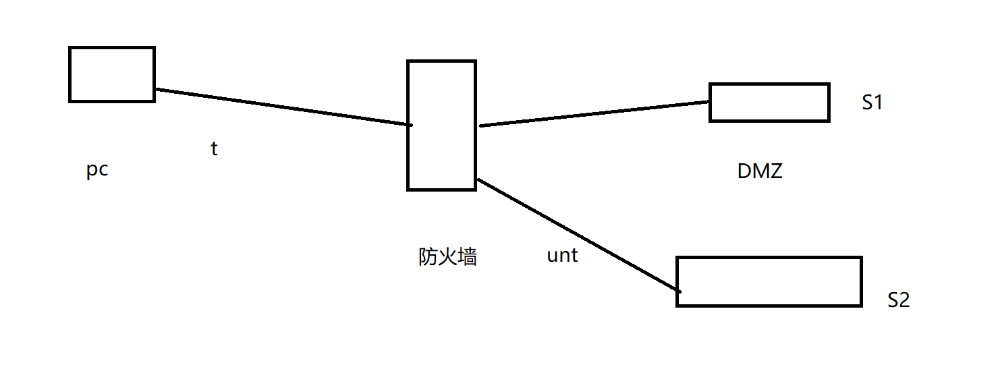

display firewall session table

trunst区域 dmz区域

包==》 每个、来回 都检测

状==》 未命中会话表，执行首包流程or 命中会话表，执行后续包流程，非首包，查找会话表

--------------

 查路由表=\=》判断接口=\=》判断zone=>判断方向=》查安全过滤规则

------------

显示会话表简要信息`display firewall session table`

显示会话表详细信息`display firewll session ver`

ftp -a 指定愿IP	

----

包过滤规则

接口 zone zone方向 内容

--------

server map 表 ==》 查路由表 ==》 包过滤规则

----------

----

g1/0/1

防火墙 { 板卡 板卡 ...}

主控板 业务板

光纤偏多

交换网板

板号/子卡号/端口号

主控板不做业务转发,0/0/0

------------------

ASPF 高级

多通道协议技术

单通道协议

控制信道 数据信道

它检查应用层协议信息并且监控连接的应用层协议. 对于特定的应用协议的所有连接, 每一个连接状态信息都将被ASPF维护并用于动态的决定数据包是否被允许通过防火墙或丢弃.

----

### 0x1 NAT

产生背景:

1. ipv4地址日渐枯竭
2. ipv6技术不能立即大面积替换
3. 各种延长IPv4寿命的技术不断出现, NAT就是其中之一.

优点:

1. 实现ip地址复用,节省地址资源
2. 转换过程对用户而言是透明的
3. 对内网用户提供隐私保护
4. 可实现对内网服务器的负载均衡.

缺点:

1. 网络监控难度加大
2. 限制于某些具体应用

> NGFW:下一代防火墙
>
> UTM: 统一威胁管理