### 防火墙查看会话实验配置

> 最终目标为在防火墙上查看到ftp的会话信息

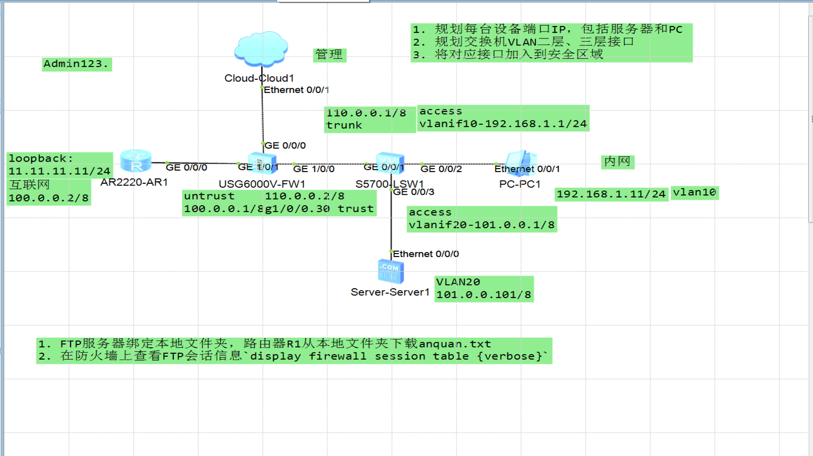

#### pc1配置

配置ip地址`192.168.1.11/24`

网关: 192.168.1.1

示例图: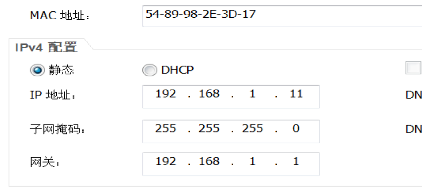

完成配置

---------

#### server1

配置ip地址`101.0.0.101/8`

配置网关 `101.0.0.1`

示例图: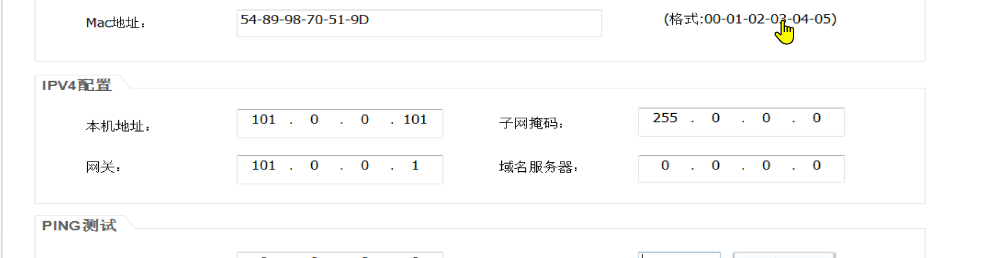

开启ftp服务,设置文件目录,示例: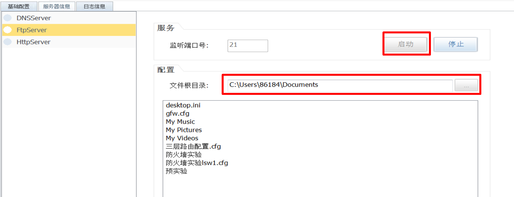

--------

#### 交换机lsw1


1. 创建vlan:`vlan batch 10 20 30`

   > 删除vlan:`undo vlan batch 10 to 20` 或 `undo vlan 10 `多次
   >
   > access口删除默认vlan:`undo port default vlan`
   >
   > 删除端口类型: `undo port link-type`
   >
   > trunk口删除允许通过的vlan: `undo port trunk allow-pass vlan 2 to 4094`
   >
   > 删除vlanif: `undo int vlanif 10`
   >
   > 删除ip: `undo ip address`

2. 配置g0/0/2为access口:
   ```
   int g0/0/2
   port link-type access
   port default vlan 10
   display this
   quit
   ```

3. 配置g0/0/3为access口

   ```
   int g0/0/3
   port link-type access
   port default vlan 20
   display this
   quit
   ```

4. 配置g0/0/1为trunk口

   ```
   int g0/0/1
   port link-type trunk
   port trunk allow-pass vlan 30
   display this
   quit
   ```

5. 配置vlanif 10

  ```
  int vlanif 10
  ip address 192.168.1.1 24
  dis th
  quit
  ```

6. 配置vlanif 20

  ```
  int vlanif 20
  ip address 101.0.0.1 8
  display this
  quit
  ```

7. 配置vlanif 30


  ```
  int vlanif 30 
  ip address 110.0.0.1 8
  display this
  quit
  ```

8. 测试. 此时pc1 server1 lsw1之间可以相互ping通

------------

#### 配置AR1


1. 配置g0/0/0口

   ```
   sys
   sysname AR1
   int g0/0/0
   display this
   ip address 100.0.0.2 8
   dis th
   quit
   ```

2. 配置loopback

   ```
   int loopback 0
   ip address 11.11.11.11 24
    display this
    quit
   dis int brief   #查看接口信息
   ```

--------

#### 配置fw1

> 云 接好后不用配置

1. 配置g0/0/0(管理口),并开放服务

   ```
   int g0/0/0
   ip address 192.168.137.190 24
   service-manage all permit
   display this
   quit
   ```

2. 配置g1/0/1

   ```
   int g1/0/1
   ip address 100.0.0.1 255.0.0.0
   display this
   quit
   ```
   
3. 配置g1/0/0.30

   ```
   int g1/0/0.30
   vlan-type dot1q 30
    ip address 110.0.0.2 255.0.0.0
   display this
   quit
   ```

4. 将接口加入区域

   > 在区域中删除加入的接口:`undo  add int g0/0/0`

   ```
   firewall zone trust
   add interface GigabitEthernet0/0/0
   add interface GigabitEthernet1/0/0.30
   display this
   quit
   firewall zone untrust 
   add interface GigabitEthernet1/0/1
   display this
   quit
   ```

5. 宿主机ping防火墙. 能ping通则云到fw没有问题.

   > 不知为何拓扑图所在的虚拟机上ping不通, 在自己的系统上ping是能通的.
   >
   > 在拓扑图中,路由与交换机是不能ping通防火墙的, 没有查明原因. 老师似乎曾提过是策略原因.

   示例图: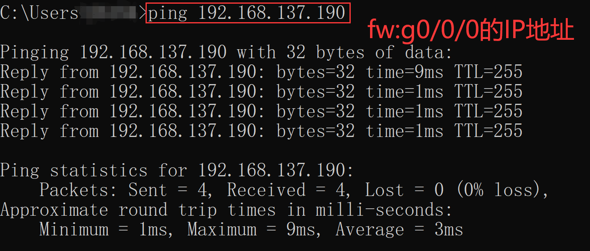

   

6. 主机访问防火墙并添加策略

   * 访问的网址为`https://192.168.137.190:8443/login.html?lang=zh_CN`.注意端口为`8443`, 浏览器会提示不安全, 你可以在**高级**中选择继续访问.

   * 用户名与密码为防火墙登录时的用户密码, 你也可以自己创建用户.

   * 登录页面示例图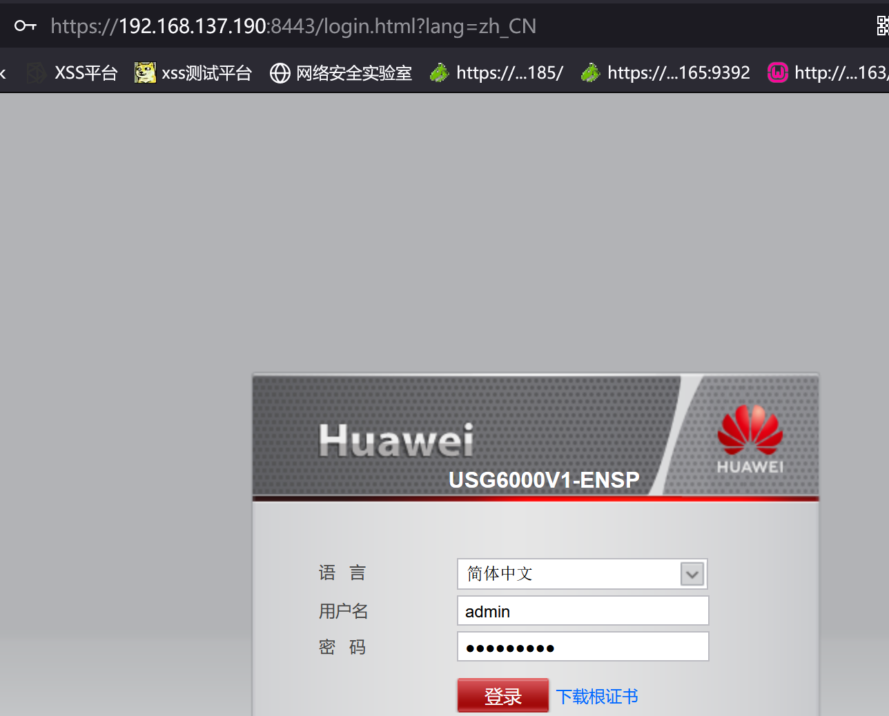

   * 你不需要进行除安全策略以外的配置.

   * 安全策略所在位置示例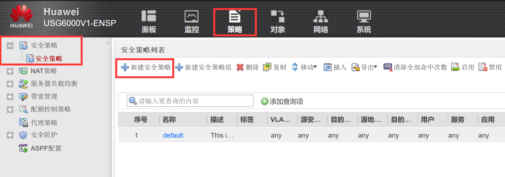

   * 添加的是untrust到trust的策略,示例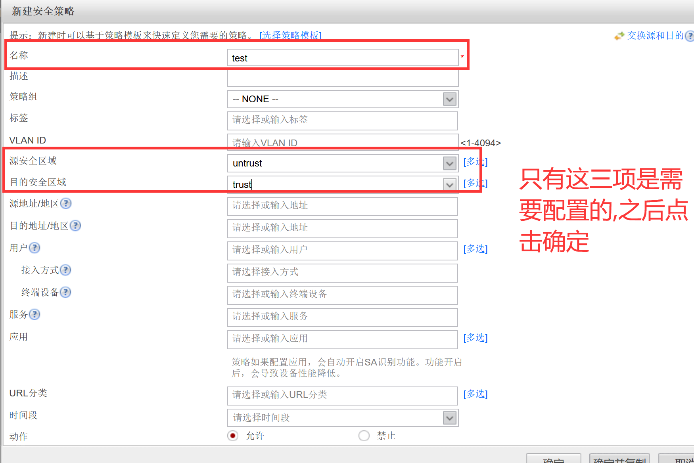

     

7. 向AR1添加到server1所在网络的路由`ip route-static 0.0.0.0 0.0.0.0 100.0.0.1`

8. 向fw添加到server1所在网络的路由:`ip route-static 101.0.0.0 255.0.0.0 110.0.0.1`

9. 向lsw1添加回到AR1:g0/0/0所在网络的路由:`ip route-static 100.0.0.0 255.0.0.0 110.0.0.2`

10. 完成之后, AR1 可以ping通 server1, 示例图: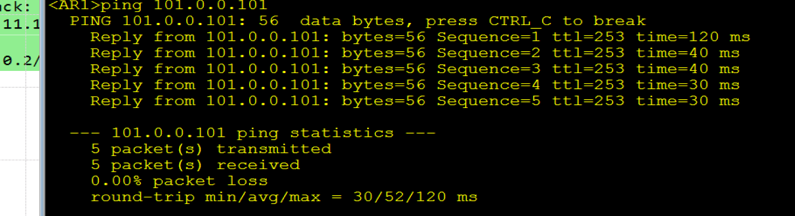

#### 测试

**AR1使用ftp访问server1**

```
ftp 101.0.0.101
dir
get anquan.txt
```
> 注意用户名是随意的,要填; 密码随意, 可以不用填.
>
> 请确定你的server1的ftp服务是开启的

示例图: 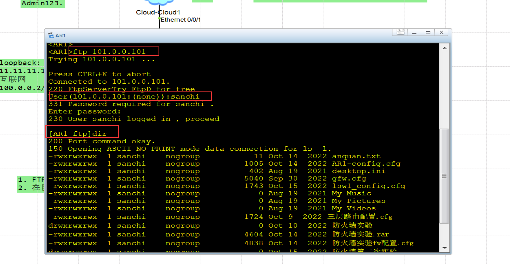

**在fw上查看会话**

* 使用的命令: `display firewall session table verbose`

* 示例图: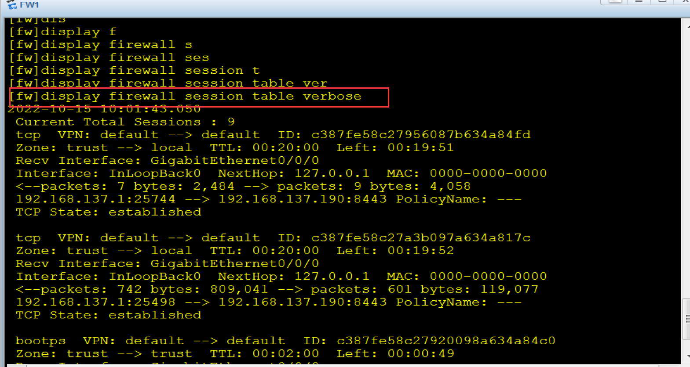

  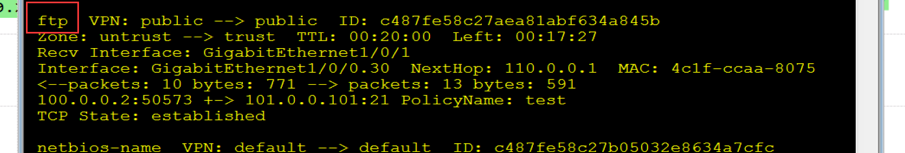

  

  --------

  到这里,实验结束了╮(╯▽╰)╭

